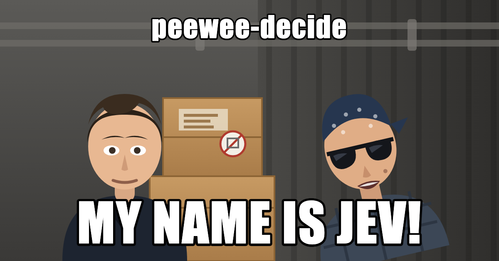

<p align="center">
  
</p>

<p align="center">
  <strong>A reflex layer for agents.</strong> Typed questions about a state, answered in one forward pass, with probabilities you can gate on.
</p>

<p align="center">
  <a href="https://opensource.org/licenses/Apache-2.0"></a>
  
  <a href="https://huggingface.co/roadius/peewee-mix-v1"></a>
</p>

---

Agents spend most of their tokens on decisions nobody reads: *which tool next, is this worth the
big model, is this input hostile, did that result actually answer the question.* A generative
model answers those by writing sentences you then have to parse, at hundreds of milliseconds and
real money per call.

Peewee answers them the way a reflex does. You hand it a state — a string, a dict, a transcript —
and a set of **typed questions**. It runs **one encoder forward pass** and returns a typed answer
per question with a calibrated probability. Nothing is generated, so there is nothing to parse and
nothing to hallucinate. It is small enough to sit in the request path: tens of milliseconds on a
GPU, and about 1,400 questions a second on one RTX 5090 behind the bundled service.

It is not a chat model and does not pretend to be. It is the part of your stack that should never
have been a chat model in the first place.

## What it is good at

| you want to | ask Peewee |
|---|---|
| route to the right tool | `choice` over your tool descriptions (`select_tool` goes hierarchical past 16 tools) |
| route to the right model | `score` on difficulty, `noul` on "needs the frontier model" |
| gate an agent step | `noul` on "is this action safe to take", with a confidence floor |
| screen input | `noul` on jailbreak, injection, spam; `score` on toxicity |
| verify a tool result | `noul` on "does this result answer the task" |
| triage anything | `choice` on intent, `score` on urgency, `noul` on churn risk |

Three question types, and that is the whole language:

| type | you give | you get back |
|---|---|---|
| `choice` | named options with descriptions | the chosen option, plus a probability for every option |
| `score` | ordered levels, low to high | the level, plus the distribution over levels |
| `noul` | nothing but the question | true or false, plus P(true) |

Every answer carries `confidence` (the probability of the answer actually reported) and `entropy`
(normalised, so 0 is certain and 1 is a coin flip). Those two numbers are the point: they are what
lets you say *act when confidence > 0.9, escalate otherwise* and mean it.

## Numbers

Peewee's own checkpoint (`mix-v1`) against the systems it is measured beside. Accuracy is against
each dataset's hard labels, scored by `peewee eval`:

| | typed-decisions | Open-Jev test | Open-Jev OOD |
|---|---|---|---|
| **Peewee mix-v1** | **0.8005** | **0.9403** | **0.8310** |
| Peewee trained on typed-decisions only | 0.7560 | 0.5455 | 0.6193 |
| Peewee trained on Open-Jev only | 0.4215 | 0.9390 | 0.8274 |
| Laya's published typed-decisions checkpoint | 0.7685 | — | — |
| TypeSafe Jev 1.13.0 *(measured here, same cases)* | 0.7385 | 0.8104 | 0.8031 |
| teacher self-agreement ceiling | *0.735* | — | — |

Three points stand out:

- **Mixing datasets beats specialising.** One checkpoint trained on both corpora beats each
  single-corpus checkpoint on its own home turf. It also clears the ceiling set by how often the
  teacher agrees with itself.
- **Against Jev, Peewee leads on accuracy on all three splits.** Peewee trained on the typed-decisions
  and Open-Jev train splits, so the out-of-distribution split is the fair one. There the lead is
  0.831 to 0.803, and it comes from score questions.
- **Calibration depends on fitting temperatures to the workload.**
  - With its per-dataset calibration files, mix-v1 is better calibrated than Jev on both
    in-distribution splits (ECE 0.021 against 0.045 on typed-decisions, 0.011 against 0.022 on
    Open-Jev test).
  - The built-in temperatures give 0.055 and 0.023.
  - On OOD, Jev stays better calibrated (0.049 against 0.147), because mix-v1 is overconfident on
    unfamiliar tasks. Run `peewee calibrate` on your own labelled cases before trusting a
    confidence threshold.

A Peewee call is one forward pass however many questions ride along, so extra questions cost
almost nothing.

| | Peewee | Jev *(measured, API)* |
|---|---|---|
| p50 per case (about 5 questions) | **17 ms** (RTX 5090), 299 ms (M5 Max laptop) | 282 ms |
| questions/second, one GPU | **1,338** (RTX 5090, 32 clients) | — |
| questions/second, 8 CPU cores | 41 | — |
| ECE, typed-decisions (own calibration file) | **0.021** | 0.045 |
| ECE, OOD split (built-in temperatures) | 0.147 | **0.049** |
| cost per million decisions | your electricity | per-token API pricing (about $0.19 for this 28k-question benchmark) |

Full methodology, per-workflow breakdowns, the honest losses and every raw report:
[`BENCHMARKS.md`](BENCHMARKS.md) and [`reports/`](reports/).

## Install

Peewee is not on PyPI yet — install it from source:

```bash
git clone https://github.com/roadius2/peewee
cd peewee
pip install -e ".[server]"          # add train, onnx or dev as needed
```

Peewee's own checkpoint, `mix-v1`, is on the Hugging Face Hub as
[`roadius/peewee-mix-v1`](https://huggingface.co/roadius/peewee-mix-v1) (Apache 2.0, about 800 MB)
and downloads on first use. Load it with `peewee_decide.load("roadius/peewee-mix-v1")`, or by name as
`mix-v1` (alias `peewee`): `peewee serve --models mix-v1`. Laya's upstream checkpoints stay available
as `english`, `multilingual` and `typed-decisions`. The training recipe below reproduces `mix-v1` in
under two hours on one GPU.

## Use it

```python
from peewee_decide import Router

router = Router(preload=True)                   # or peewee_decide.load("<your checkpoint dir>")

state = {"task": "refund the duplicate March charge for acme.com",
         "last_tool_result": "invoice #4411: two identical charges on 2026-03-02"}

questions = {
    "next_tool": {
        "type": "choice",
        "instructions": "Which tool should run next?",
        "criteria": {"issue_refund": "return money for a confirmed duplicate charge",
                     "fetch_invoice": "look up invoice details",
                     "ask_human": "the decision needs a person"},
    },
    "needs_frontier_model": {
        "type": "noul",
        "instructions": "Does this step need a frontier model rather than a small one?",
    },
    "risk": {
        "type": "score",
        "instructions": "How risky is taking this action without review?",
        "criteria": ["routine", "worth logging", "needs a human"],
    },
}

res = router.predict(state, questions)          # one forward pass, all three questions

tool = res["answers"]["next_tool"]
if tool["confidence"] > 0.9:
    call(tool["choice"])                        # -> issue_refund
else:
    escalate(tool["probabilities"])             # the full distribution, not just the winner
```

Presets for the common jobs are one call: `triage_questions()`, `guard_questions()`,
`moderation_questions()`, `router_questions()`, `email_questions()`. Patterns that need more than
one pass are in `peewee_decide.patterns`: `select_tool` (flat or hierarchical), `hierarchical_choice`
(a group choice then a member choice), and `speculative_choice` (the primary choice and every
option's follow-up in a single pass, then keep the branch that won — free, because passes are
per call, not per question).

### Routing between checkpoints

The English checkpoint collapses on other languages; the multilingual one is slightly weaker on
English. `Router` decides per request, in pure Python, before any weights are touched:

```python
res["routing"]["model"]                         # -> english
res["routing"]["reason"]                        # why that checkpoint, in words

# decide without running a forward pass
router.route({"body": "Der Kunde wurde zweimal belastet"}, questions).reason
# "Latin script but language looks like 'de', not English"
```

Precedence is explicit `model` > `task` > `lang` > detected script/language > default. Script
detection is exact; the Latin-script language guess is a deliberately biased heuristic, and
`register_language_detector` swaps in a real detector when you have one.

### Serve it

```bash
peewee serve --models english,multilingual      # FastAPI on :8000
```

`POST /v1/decide` and `/v1/decide/batch`, plus `/healthz`, `/readyz` and Prometheus `/metrics`.
Every checkpoint gets a dynamic batcher: requests arriving while a pass is running are collected
and go out together the moment it finishes, which is what turns 467 questions/s into 1,338 under
32 concurrent clients. Configuration is environment variables (`PEEWEE_MODELS`, `PEEWEE_MAX_BATCH`,
`PEEWEE_MAX_WAIT_MS`, `PEEWEE_API_KEY`, `PEEWEE_BACKEND=onnx`, …), all documented in
`peewee_decide/serving.py`. There is a CPU Dockerfile and a CUDA one in `docker/`.

An ONNX export runs the same API without torch: `peewee export-onnx <checkpoint> ./out [--quantize]`,
then `PEEWEE_BACKEND=onnx`. Weight-only int8 is 40% of the size and matches fp32 to within 0.06;
it is not faster on CPU, so take it for the footprint, not the speed.

## Train your own

This is where the accuracy is. Peewee's own numbers come from fine-tuning the base encoder on
typed decision data — the base checkpoints answer real typed-decision benchmarks near chance.

```bash
pip install -e ".[train]"
peewee prepare-data typed-decisions --out data/typed-decisions
peewee prepare-data open-jev --out data/open-jev

peewee train --data data/typed-decisions/train.jsonl:4 --data data/open-jev/train.jsonl \
             --calibration-target label --base english --out runs/mix-v1 \
             --max-len 1024 --head-max-len 256

peewee eval runs/mix-v1 --data data/typed-decisions/test.jsonl
```

That is `mix-v1`: 101 minutes on one RTX 5090. `--data` repeats, and `FILE:N` upsamples that file's
cases N times per epoch — here typed-decisions goes from 7% to 21% of the mix, which is what pushes
typed-decisions accuracy past every single-corpus model. Your own data is one JSONL of
`{state, questions, targets}` cases (schema in `peewee_decide/data.py`); soft targets from a teacher
model and hard labels both work.

`peewee train` holds out whole cases (never questions from a case it trained on), fits per-type and
per-option-count temperatures on them, and writes a checkpoint the runtime loads directly plus a
`train_meta.json` recording data hashes, skipped questions and per-epoch metrics.

### Calibration is per workload

Confidence is only worth gating on if it is honest. Peewee ships the fitting machinery and one
finding worth repeating: **a single temperature map does not serve two different workloads.** In
`mix-v1`, 86% of held-out items came from one corpus, so the fitted temperatures followed it and
the other corpus ended up worse calibrated than a model trained on it alone — with accuracy
unaffected, because temperature never moves an argmax.

So fit on the data you will actually see:

```python
agent = router.load("english")                             # or peewee_decide.load(<dir>)
records = peewee_decide.collect_records(agent, examples)   # (state, questions, labels)
agent.fit_temperatures(records)
agent.save_calibration("calibration.json")
peewee_decide.load("<your checkpoint dir>", calibration="calibration.json")
```

or, at training time, `peewee train --calib-data your-holdout.jsonl`.

## Limits, stated plainly

- **Zero-shot, it is weak.** The value is in the fine-tune; a base checkpoint on a real typed
  decision benchmark sits near chance.
- **Context is short.** 1,024 tokens. We measured evidence placed past the trained length and the
  model is at chance on it — long context needs a fine-tune at length, not a bigger `max_len`.
- **Keep `choice` under ~20 options**, or go hierarchical.
- **Ordinal `score` is the weakest primitive.**
- **Option order matters more than we would like** (0.00–0.23 flip rate depending on the suite).
- **Out-of-the-box confidence is over-confident.** Fit temperatures. It takes minutes.

## Repository map

| | |
|---|---|
| `peewee_decide/` | the package: `agent.py` (the three-stage pipeline), `router.py`, `serving.py`, `train.py`, `evaluate.py`, `data.py`, `calibrate.py`, `onnx_backend.py`, `patterns.py`, `presets.py` |
| `BENCHMARKS.md` | every measurement, with method and raw-report pointers |
| `REVIEW.md` | the engineering plan, phase by phase, and the open questions |
| `CHANGELOG.md` | what changed and why |
| `reports/` | raw validation and training evidence per machine |
| `docs/GPU_VALIDATION.md` | how to reproduce the GPU runs |

Tests run without weights or network: `python -m pytest` (282 tests, about 10 seconds).

---

### Credits and licence

Peewee is Apache 2.0, and is a renamed derivative of [Laya](https://github.com/NandhaKishorM/laya)
by Convai Innovations / Nandakishor M, also Apache 2.0, whose commit history this repository keeps
and whose base checkpoints Peewee fine-tunes. The RLCD training objective is theirs; the training
CLI, evaluation harness, router, service, ONNX backend, dataset tooling and every number above are
this project's. See [`NOTICE`](NOTICE) for the full attribution and [`CHANGELOG.md`](CHANGELOG.md)
for the divergence.

Peewee is not affiliated with, endorsed by or sponsored by Convai Innovations, TypeSafe (Jev) or
the Open-Jev project; those names appear only to identify the systems Peewee is compared against,
and their published figures are quoted as published, never re-measured here. Datasets
(`LocalLLaMA/typed-decisions`, Open-Jev release-v2 redistributable, CC0-1.0) belong to their
publishers and are downloaded at a pinned revision, never redistributed here.

The banner is original artwork, and the joke belongs to whoever said it first.
